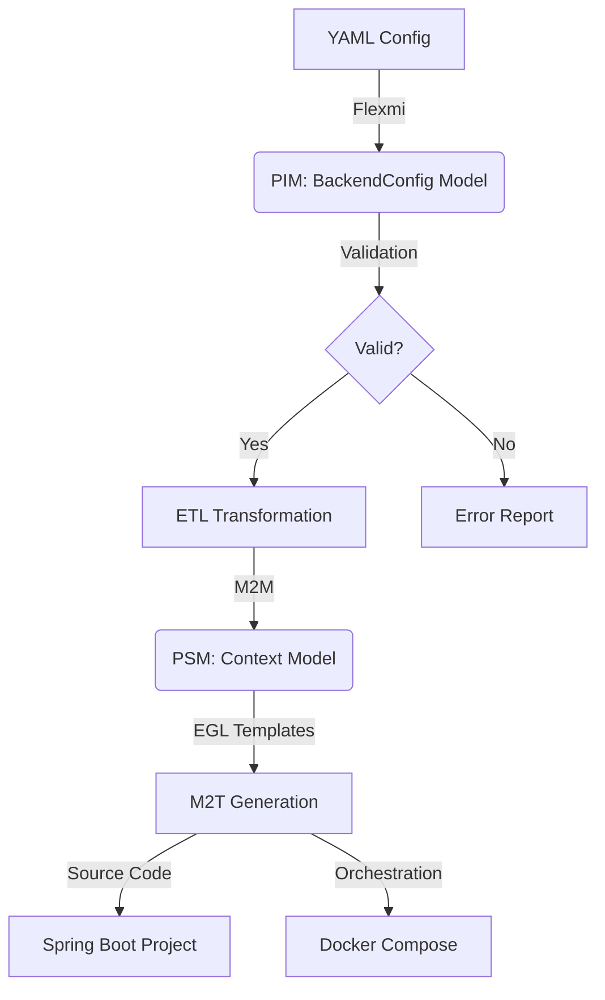

# 🚀 Model-Driven Backend Generator (MDE)

A powerful, metamodel-driven code generation engine that transforms high-level YAML specifications into fully functional Spring Boot microservices.

[](https://opensource.org/licenses/MIT)
[](https://www.oracle.com/java/technologies/downloads/)
[](https://spring.io/projects/spring-boot)

---

## 🌟 Overview

MDE leverages the **Eclipse Epsilon** stack and **EMF (Eclipse Modeling Framework)** to implement a robust Model-Driven Software Engineering (MDSE) pipeline. Define your data entities, relationships, and API routes in a simple YAML file, and MDE handles the rest—generating production-ready Java code, database configurations, and Docker orchestration.

### Key Features

- **YAML-to-Model Parsing**: Uses `Flexmi` for flexible, metamodel-driven injection.
- **State-of-the-Art Transformations**: 
    - **M2M**: Eclipse ETL maps your domain-specific PIM to a platform-specific PSM.
    - **M2T**: Eclipse EGL templates generate clean, maintainable Java code.
- **Visual Design**: Includes **MDE Studio**, a web interface to design your backend visually.
- **Built-in Validation**: Comprehensive OCL-like validation for foreign keys, primary keys, and reserved keywords.
- **Full-Stack Output**: Generates Entities, Repositories, Services, Controllers, and Docker Compose files.

---

## 🏗 Architecture

MDE follows the classic MDA (Model Driven Architecture) approach:



---

## 🚀 Getting Started

### Prerequisites

- **Java 17** or higher
- **Maven 3.8+**
- **Docker** (optional, for running generated systems)

### Installation

```bash
git clone https://github.com/shady0503/Model-Driven-Engineering.git
cd Model-Driven-Engineering
./mvnw clean install
```

### Usage (CLI)

Generate a project from a YAML specification:

```bash
./bin/mde-gen.sh generate -i examples/blog-example.yaml -o output/my-blog
```

### Usage (Web UI)

Design your model visually:

```bash
cd mde-studio
npm install
npm run dev
```

---

## 📁 Project Structure

- `model/`: Ecore metamodels (PIM & PSM).
- `src/main/java/com/mde/`: Backend logic, validation, and generation engines.
- `src/main/resources/templates/`: EGL code generation templates.
- `mde-studio/`: Visual modeling web interface.
- `examples/`: Sample configurations to get you started.
- `docs/`: In-depth documentation, including the [File Documentation Guide](./docs/CODEBASE_DOCUMENTATION.md).

---

## 📄 License

This project is licensed under the MIT License - see the [LICENSE](LICENSE) file for details.
